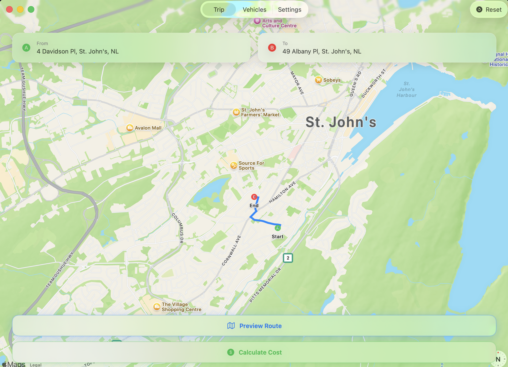
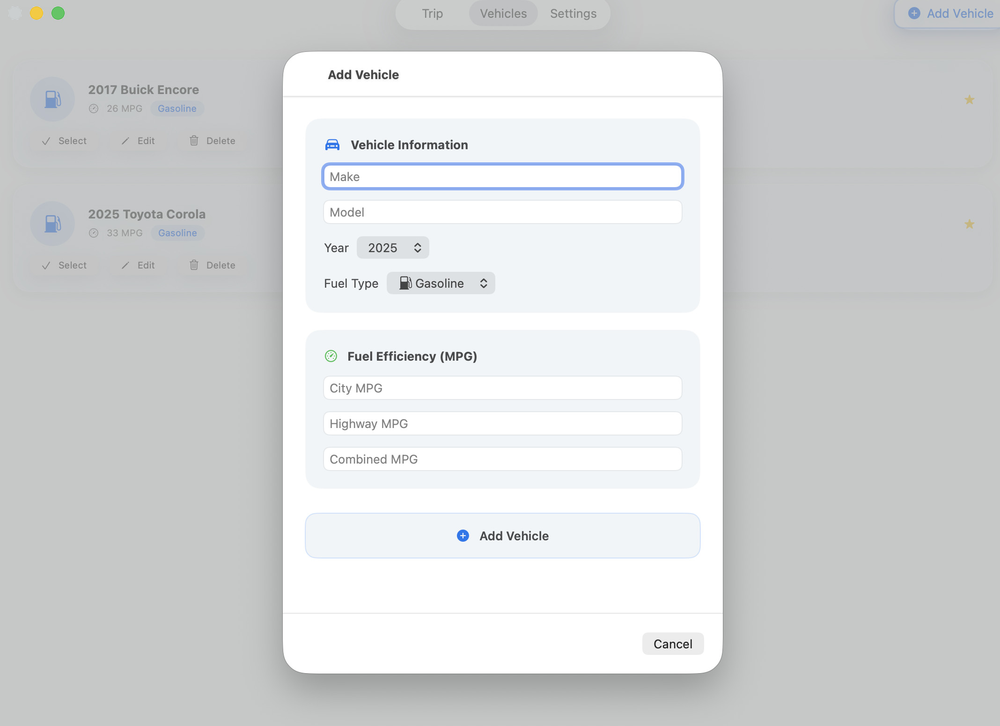
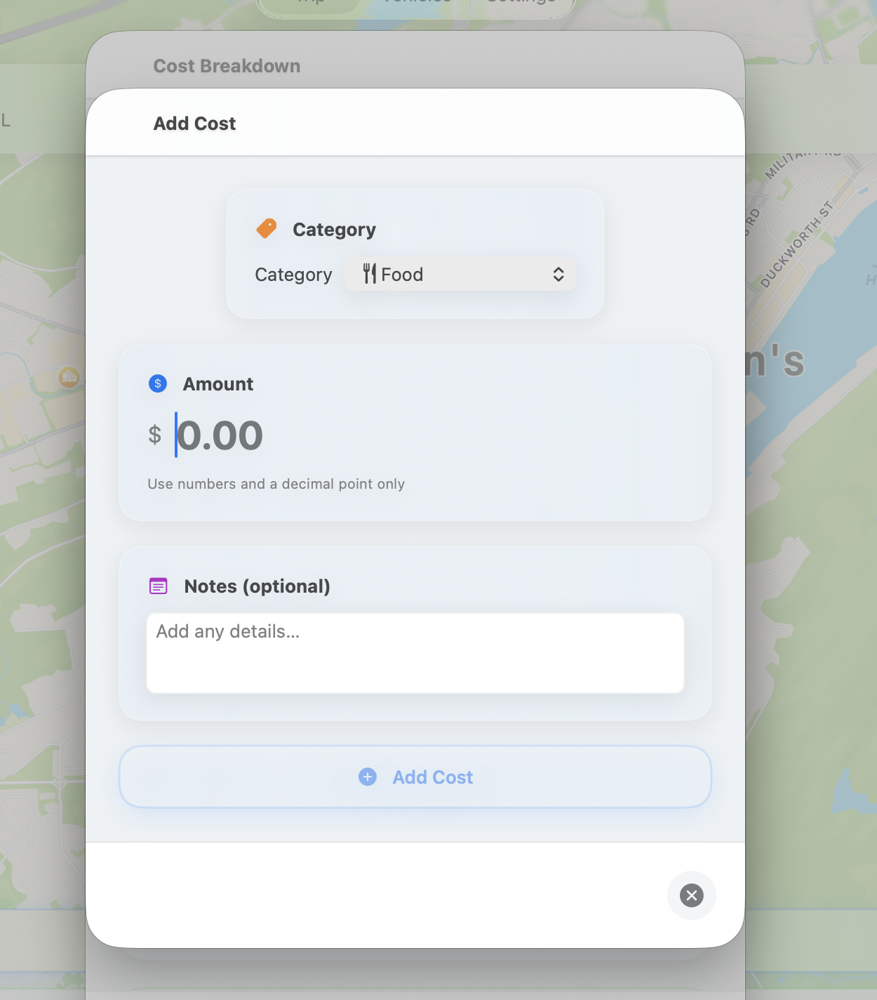
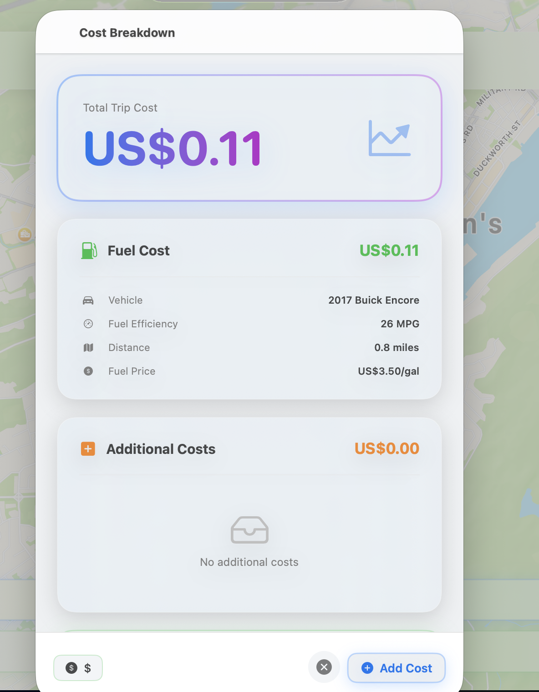
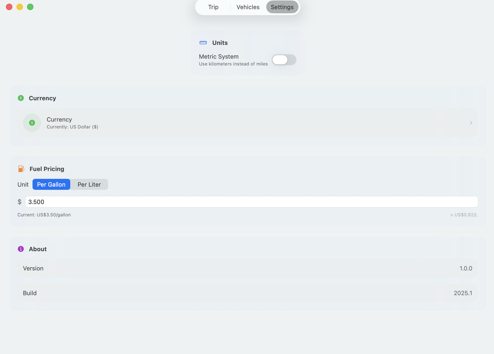

# TripCost

A modern macOS trip cost calculator with beautiful glass UI design.

[](https://github.com/SOFTowaha/TripCost/actions/workflows/build.yml)
[](https://github.com/SOFTowaha/TripCost/actions/workflows/release.yml)

## Features

✨ **Modern Glass UI** - Beautiful frosted glass design inspired by macOS Big Sur and later *(Oct 2025)*  
🗺️ **Interactive Map** - Plan your trips with Apple Maps integration *(Oct 2025)*  
⛽ **Fuel Cost Calculation** - Calculate trip costs based on vehicle fuel efficiency *(Oct 2025)*  
🚗 **Vehicle Management** - Save and manage multiple vehicles *(Oct 2025)*  
💰 **Cost Splitting** - Split costs among multiple travelers *(Oct 2025)*  
💱 **Multi-Currency** - Support for multiple currencies *(Oct 2025)*  
📊 **Detailed Breakdown** - View fuel costs and additional expenses *(Oct 2025)*  
💾 **Save & Manage Trips** - Save trips with routes, costs, and share with friends *(Oct 20, 2025)*  
✏️ **Editable Saved Trips** - Edit split costs for saved trips with live calculations *(Oct 20, 2025)*  
📍 **Location Tracking** - Auto-capture place names from map selections *(Oct 20, 2025)*  
📋 **Camping Checklist** - Editable packing lists with templates for food, clothing, gear, and activities *(Oct 27, 2025)*
☀️ **Weather Forecasts** - Automatic weather fetching for trip destinations with current conditions *(Oct 27, 2025)*  
🔐 **Secure API Key Storage** - Store your OpenWeatherMap API key securely in macOS Keychain via Settings *(Oct 27, 2025)*


## Requirements

- macOS 14.0 (Sonoma) or later
- Xcode 15.0+ (for development)

## Installation

### Download Release

1. Download the latest release from [Releases](https://github.com/SOFTowaha/TripCost/releases)
2. Open the DMG file
3. Drag TripCost to your Applications folder
4. Launch TripCost from Applications

### Build from Source

1. **Clone the repository:**
   ```bash
   git clone https://github.com/SOFTowaha/TripCost.git
   cd TripCost
   ```

2. **Configure API keys:**
   ```bash
   cp .env.example .env
   # Edit .env and add your OpenWeatherMap API key
   ```
   
   **Alternative:** Configure API keys through the Settings page in the app (stored in Keychain) or via Xcode scheme environment variables. See [Configuration Guide](docs/CONFIGURATION.md) for all options.

3. **Open in Xcode:**
   ```bash
   open TripCost.xcodeproj
   ```

4. **Build and run** (⌘R)

See [Configuration Guide](docs/CONFIGURATION.md) for detailed setup instructions.
## Screenshots

Screenshots of the app are available in the [`screenshots`](./screenshots) directory:

| Page                | Screenshot                                  |
|---------------------|---------------------------------------------|
| Main View           |       |
| Add Vehicle         |   |
| Add Cost            |         |
| Cost Breakdown      |  |
| Settings            |         |
| Map Selection       |  | ✅

> To update screenshots, use the provided script in the project root.

Then build and run in Xcode (⌘R)

## Usage

1. **Select Route**: Choose your starting point and destination on the map
2. **Choose Vehicle**: Select or add a vehicle with its fuel efficiency
3. **Calculate Cost**: View detailed cost breakdown including fuel and additional expenses
4. **Split Costs**: Divide the total cost among multiple travelers
5. **Manage Settings**: Adjust currency, units, fuel prices, and configure weather API key securely

## Architecture

- **SwiftUI** - Modern declarative UI framework
- **MapKit** - Apple Maps integration
- **Observation** - New Swift observation framework
- **MVVM** - Model-View-ViewModel architecture

## Development

### Project Structure

```
TripCost/
├── Models/          # Data models (Vehicle, TripRoute, Currency, etc.)
├── ViewModels/      # Business logic and state management
├── Views/           # SwiftUI views
├── Services/        # API services and data persistence
└── Utilities/       # Helper functions and constants
```

### CI/CD

This project uses GitHub Actions for continuous integration and deployment:

- **Build Workflow**: Runs on every push and PR to ensure code builds successfully
- **Release Workflow**: Creates DMG and ZIP packages when a new version tag is pushed

## Contributing

Contributions are welcome! Please feel free to submit a Pull Request.

1. Fork the repository
2. Create your feature branch (`git checkout -b feature/AmazingFeature`)
3. Commit your changes (`git commit -m 'Add some AmazingFeature'`)
4. Push to the branch (`git push origin feature/AmazingFeature`)
5. Open a Pull Request

## Future Plans

TripCost is evolving into a comprehensive trip planning tool for camping, hiking, and outdoor adventures. Here's what's coming:

### 🗺️ Trip Management
- [x] Save and manage multiple trips *(Oct 20, 2025)*
- [x] Trip history with dates and locations *(Oct 20, 2025)*
- [x] Export trip data (Share functionality) *(Oct 20, 2025)*
- [ ] Favorite routes and destinations
- [ ] Export trip data to PDF/CSV
- [ ] Nearby attractions and Food

### 📝 Notes & Lists
- [x] Camping checklist with templates *(Oct 27, 2025)*
- [x] Packing lists (food, clothing, gear) *(Oct 27, 2025)*
- [x] Activity templates (hiking, camping, road trip) *(Oct 27, 2025)*
- [ ] Notes feature for trip planning
- [ ] Trail-specific notes and tips

### 🏕️ Camping & Outdoor Features
- [x] Weather forecasts for destinations *(Oct 27, 2025)*
- [ ] Campground finder integration
- [ ] Trail difficulty ratings
- [ ] Hiking distance and elevation tracking
- [ ] Wildlife and safety alerts

### 🍽️ Trip Expenses
- [x] Food budget tracking (Additional costs feature) *(Oct 20, 2025)*
- [x] Per-person expense breakdown (Split cost feature) *(Oct 20, 2025)*
- [ ] Camping gear costs
- [ ] Park entrance fees
- [ ] Equipment rental tracking
- [ ] Per-day expense breakdown

### 🎒 Gear & Equipment
- [ ] Gear checklist manager
- [ ] Equipment weight calculator
- [ ] Gear recommendations by trip type
- [ ] Shared gear tracking for group trips

### 👥 Group Trip Features
- [x] Group expense splitting *(Oct 20, 2025)*
- [x] Shared trip planning (Share functionality) *(Oct 20, 2025)*
- [ ] Task assignments
- [ ] Real-time trip updates

### 📱 Additional Features
- [ ] Offline maps support
- [ ] Weather Forecast
- [ ] Image Upload/Save
- [ ] GPS tracking during trips
- [ ] Photo gallery per trip
- [ ] Trip timeline/itinerary builder
- [ ] Emergency contacts and info

Want to suggest a feature? [Open an issue](https://github.com/SOFTowaha/TripCost/issues) or contribute!

## Roadmap & Kanban

- Roadmap timeline and sprints: see [`docs/ROADMAP.md`](./docs/ROADMAP.md)
- Project Kanban (GitHub Projects): create and view "TripCost Roadmap" under your GitHub Projects.
	- Quick setup: run the script to bootstrap labels, a Kanban project with Iterations, and issues generated from Future Plans.

### Bootstrap (optional)

Run locally with GitHub CLI (requires authentication with repo/project access):

```bash
# one-time
brew install gh jq
gh auth login

# create labels, project with iterations, and seed issues from Future Plans
bash scripts/bootstrap_project_and_issues.sh
```

Afterwards, link the created Project in this section (Project → Share → copy URL).

## License

[Choose your license - MIT, Apache 2.0, etc.]

## Author

**Syed Omar Faruk Towaha**

- GitHub: [@SOFTowaha](https://github.com/SOFTowaha)

## Acknowledgments

- Apple Maps for routing and location services
- SwiftUI for the modern UI framework
- The macOS development community

---

Made with ❤️ for macOS
